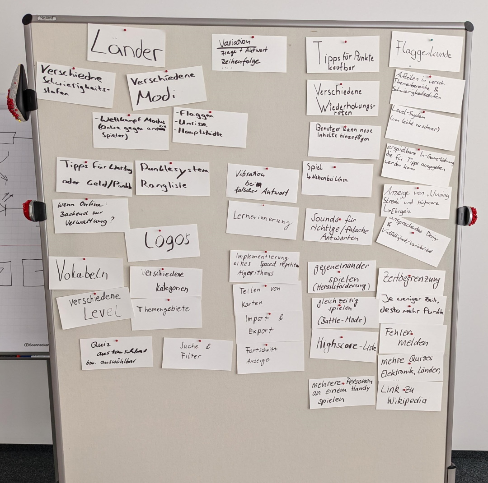

# Lern-App 2022.2

Elektronik-Symbole oder Messtechnik-Symbole erlernen mit einer App für Smartphones 📱.

## Mittwoch 28.9.2022

Heute beschäftigten wir uns mit der Installation von allem, was man zur Entwicklung einer Smartphone-App braucht. Die [Android Studio Präsentation (PPTX⇓)](https://github.com/BogyMitutoyoCTL/Checklisten-App-2022.1/blob/main/AndroidStudio.pptx) erklärt die einzelnen Schritte.

Die Downloads haben wir bereits erledigt und auf einem USB Stick zur Verfügung gestellt:

- Java SDK (JDK) namens [Amazon Corretto](https://aws.amazon.com/de/corretto/)
- [Android Studio](https://developer.android.com/studio)
- das Flutter-Plugin für Android Studio (Download innerhalb von Android Studio)
- [Flutter](https://docs.flutter.dev/get-started/install/windows)
- Emulator / virtuelle Geräte (Download innerhalb von Android Studio)

## Mittwoch 21.9.2022

Wir haben mit einer Vorstellungsrunde begonnen und dann eine Firmenführung gemacht. Im Messraum haben wir ein paar Messmaschinen von Mitutoyo angeschaut.

Die [Firmenpräsentation (PPTX ⇓)](Firmenpräsentation.pptx) enthält auch Informationen über das Studium. Ein Blick in die [Studentenwohnung (PPTX ⇓)](Studentenwohnung.pptx) war auch möglich. Zum Schluss haben wir Github Accounts eingerichtet und dem Projekt zugeordnet.

Hausaufgaben:

* Fotofreigabe ausfüllen und von den Eltern unterschreiben lassen
* ggf. Github Account anlegen und Einladung akzeptieren
* Besuch des Betreuungslehrers klären

### Ideen und Aufgaben für die Lern-App

Wir haben zunächst mündlich erklärt, was wir uns für eine App wünschen. Basierend darauf, habt ihr folgende Punkte identifiziert, was die App alles können müsste:

* Quiz: Flaggen (2 Nennungen)
  * Aufteilen nach Kontintenten
  * Aufteilung nach Schwierigkeitsstufen (2 Nennungen)
  * Level-System / Freischalten von Quizes nach Absolvierung eines anderen Quizes (2 Nennungen)
* In-Game-Währung, mit denen man sich Tipps kaufen kann (2 Nennungen)
* Winning-Streak Bonuspunkte
* Highscore-Liste für sich selbst / mit anderen vergleichen
* ansprechendes Design
* Wiederholung nach Zeit, je nach dem, wie oft man es richtig/falsch gemacht hat
* Benutzer kann eigene Fragen hinzufügen
* Nebenbei lernen, nicht nur richtig/falsch-Antworten
* Quiz: Umrisse
* Quiz: Hauptstädte
* Wettkampfmodus
* Tipps für Werbung oder Geld
* Quiz: Vokabeln
* Quiz: Logos (z.B. Mc Donalds)
* Erinnerung ans Lernen
* Spaced Repetition Algorithmus
* Teilen von Karten / Quizes, bzw. Import/Export von Karten
* Suche nach Wörtern o.ä.
* Quiz: Elektronik
* Quiz: Messtechniksymbole (Geradheit)
* Sounds für richtige Antworten / falsche Antworten
* Quizes auswählbar
* gegeneinander spielen
* gleichzeitig gegeneinander spielen
* mehrere Personen an einem Handy spielen
* Zeitbegrenzung
  * mehr Punkte je schneller die Antwort
* Link zu Wikipedia
* Fehler melden: falsche Lösungen berichten
* Fortschrittsanzeige: wie viele Fragen kommen noch

Ein paar [Ideen für die Lern-App](Idee%20Lern-App.pptx) haben wir schon mal aufgezeichnet, damit ihr Euch besser vorstellen könnt, was für eine App wir uns ungefähr wünschen.