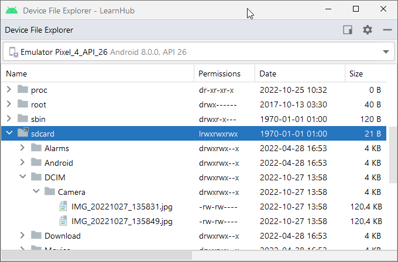
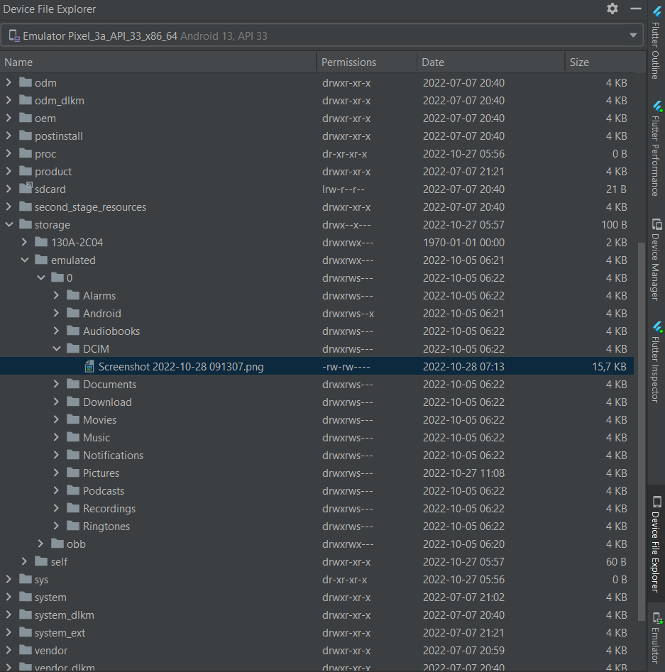
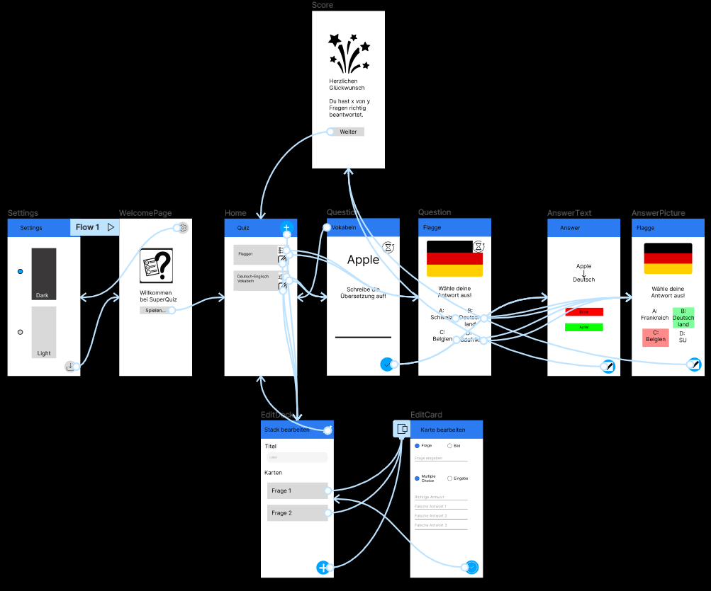

# Lern-App 2022.2

Elektronik-Symbole oder Messtechnik-Symbole erlernen mit einer App für Smartphones 📱.

## Ergebnis

## Dienstag 25.10.2022 bis Freitag 28.10.2022

Wir haben begonnen, unsere eigenen Widgets zu programmieren, wie wir sie am Vortag diskutiert haben.

## Tolle Widgets, die wir eingesetzt haben

Neben den in der  [Flutter (PPTX⇓)](Flutter.pptx)  Präsentation erwähnten Widgets haben wir folgende tollen Widgets verwendet:

* `FloatingActionButton`: die runden Buttons am unteren Rand des Bildschirms
* `WillPopScope`: kann verhindern, dass man zurück gehen kann
* `BoxDecoration`: kann abgerundete Ecken erzeugen
* `InputDecoration` zusammen mit `OutlineInputBorder`: kann einen Rahmen um ein Text-Eingabefeld erzeugen, damit man weiß, was man eintragen muss
* `Expanded`: kann ein Element von seiner Breite her ausdehnen, damit andere Elemente in einer `Row` nach hinten verschoben werden.
* `AlertDialog`: kann eine Meldung auf dem Bildschirm anzeigen, die bestätigt werden muss
* `Image.asset`: für Bilder, die Teil der App sind
* `CircularProgressIndicator`: ein Wartekringel, während Daten geladen werden

### Daten zum Testen auf das Smartphone übertragen

Je nach Smartphone, das emuliert wird, kann man Bilder nach `/sdcard/DCIM/Camera` übertragen

oder nach `/storage/emulated/0/DCIM`:

### Warnungen loswerden

In unserem Projekt gab es Warnungen mit dem Text

> Warning: Mapping new ns http://schemas.android.com/repository/android/common/02 to old ns http://schemas.android.com/repository/android/common/01

Um diese Warnungen loszuwerden, haben wir die Gradle Version und das SDK aktualisiert

1. den Unterordner `android` unseres Projekts in Android Studio öffnen
2. Im Menü "Tools/AGP Upgrade Assistent" auswählen
3. Die Gradle Version aktualisieren (bei mir: von 4.1.3 auf 4.2.2)

Dann wieder zurück zum eigentlichen Projekt.

1. Appearance & Behavior / System Settings / Android SDK
2. SDK Tools: Android SDK Build Tools auf Version 33 aktualisieren

## Montag 24.10.2022

Wir haben am Vormittag die Übungen für [Flutter (PPTX⇓)](Flutter.pptx) beendet und sind nun in der Lage, eigene Apps mit mehreren Seiten und Navigation zu erstellen.

Danach haben wir mit Hilfe von [Figma](https://www.figma.com) eine grobe Skizze erstellt, wie unsere App aussehen soll und wie der Ablauf sein könnte:

Für unsere App wurden mehrere Namensvorschläge gemacht:

* Lernmaster
* Merk Dir Was
* Lern dich schlau
* Simpel schlau
* Hirngespinst
* Lernhub
* Studienhelfer
* Studyhub
* Megabrain
* Lernstudio
* Studienmeister
* Simpelklub
* Learnhub
* 100% schlau
* Learning hub
* Lernplattform
* Lern-App
* Studymaster

Per Abstimmung haben wir uns dann auf den Namen **Learnhub** geeinigt.

Wir haben [Git](https://git-scm.com/download/win) und [GitExtensions](http://gitextensions.github.io/) installiert und dieses Repository geklont.

## Mittwoch 19.10.2022

Nach mehreren Nachmittagen haben wir heute die [Dart Präsentation (PPTX⇓)](Dart.pptx) abgeschlossen.

Danach ging es los mit den Oberflächenobjekten für Android-Anwendungen, die in [Flutter (PPTX⇓)](Flutter.pptx) beschrieben werden.

## Mittwoch 12.10.2022

Es ging weiter mit der [Dart Präsentation (PPTX⇓)](Dart.pptx) bis Folie 80.

## Mittwoch 5.10.2022

Wir haben Fortschritte in der [Dart Präsentation (PPTX⇓)](Dart.pptx) gemacht und sind bis Folie 51 gekommen.

Hausaufgabe:

* Nutze [DartPad](https://dartpad.dev/) oder Android Studio und programmiere eine Funktion, die das gleiche Ergebnis liefert wie math.pow(). Zulässige Annahme: die beiden Parameter (Basis und Exponent) sind natürliche Zahlen (n ∈ ℕ₀)

## Mittwoch 28.9.2022

Heute haben wir uns mit der Installation von allem, was man zur Entwicklung einer Smartphone-App braucht beschäftigt. Die [Android Studio Präsentation (PPTX⇓)](AndroidStudio.pptx) erklärt die einzelnen Schritte.

Die Downloads hatten wir bereits größtenteils erledigt und auf einem USB Stick zur Verfügung gestellt:

- Java SDK (JDK) namens [Amazon Corretto](https://aws.amazon.com/de/corretto/)
- [Android Studio](https://developer.android.com/studio)
- das Flutter-Plugin für Android Studio (Download innerhalb von Android Studio)
- [Flutter](https://docs.flutter.dev/get-started/install/windows)
- Emulator / virtuelle Geräte (Download innerhalb von Android Studio)

Nach Fertigstellung der Installation haben wir mit der [Dart Präsentation (PPTX⇓)](Dart.pptx) begonnen. Dort sind wir bis zu Folie 13 gekommen.

Hausaufgabe:

- Nutze [DartPad](https://dartpad.dev/) oder Android Studio und berechne $x = 356 * 4^3$
  

## Mittwoch 21.9.2022

Wir haben mit einer Vorstellungsrunde begonnen und dann eine Firmenführung gemacht. Im Messraum haben wir ein paar Messmaschinen von Mitutoyo angeschaut.

Die [Firmenpräsentation (PPTX ⇓)](Firmenpräsentation.pptx) enthält auch Informationen über das Studium. Ein Blick in die [Studentenwohnung (PPTX ⇓)](Studentenwohnung.pptx) war auch möglich. Zum Schluss haben wir Github Accounts eingerichtet und dem Projekt zugeordnet.

Hausaufgaben:

* Fotofreigabe ausfüllen und von den Eltern unterschreiben lassen
* ggf. Github Account anlegen und Einladung akzeptieren
* Besuch des Betreuungslehrers klären

### Ideen und Aufgaben für die Lern-App

Wir haben zunächst mündlich erklärt, was wir uns für eine App wünschen. Basierend darauf, habt ihr folgende Punkte identifiziert, was die App alles können müsste:

* Quiz: Flaggen (2 Nennungen)
  * Aufteilen nach Kontintenten
  * Aufteilung nach Schwierigkeitsstufen (2 Nennungen)
  * Level-System / Freischalten von Quizes nach Absolvierung eines anderen Quizes (2 Nennungen)
* In-Game-Währung, mit denen man sich Tipps kaufen kann (2 Nennungen)
* Winning-Streak Bonuspunkte
* Highscore-Liste für sich selbst / mit anderen vergleichen
* ansprechendes Design
* Wiederholung nach Zeit, je nach dem, wie oft man es richtig/falsch gemacht hat
* Benutzer kann eigene Fragen hinzufügen
* Nebenbei lernen, nicht nur richtig/falsch-Antworten
* Quiz: Umrisse
* Quiz: Hauptstädte
* Wettkampfmodus
* Tipps für Werbung oder Geld
* Quiz: Vokabeln
* Quiz: Logos (z.B. Mc Donalds)
* Erinnerung ans Lernen
* Spaced Repetition Algorithmus
* Teilen von Karten / Quizes, bzw. Import/Export von Karten
* Suche nach Wörtern o.ä.
* Quiz: Elektronik
* Quiz: Messtechniksymbole (Geradheit)
* Sounds für richtige Antworten / falsche Antworten
* Quizes auswählbar
* gegeneinander spielen
* gleichzeitig gegeneinander spielen
* mehrere Personen an einem Handy spielen
* Zeitbegrenzung
  * mehr Punkte je schneller die Antwort
* Link zu Wikipedia
* Fehler melden: falsche Lösungen berichten
* Fortschrittsanzeige: wie viele Fragen kommen noch

Ein paar [Ideen für die Lern-App](Idee%20Lern-App.pptx) haben wir schon mal aufgezeichnet, damit ihr Euch besser vorstellen könnt, was für eine App wir uns ungefähr wünschen.